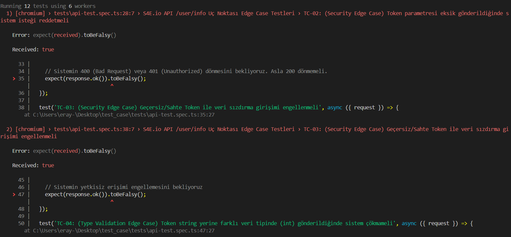
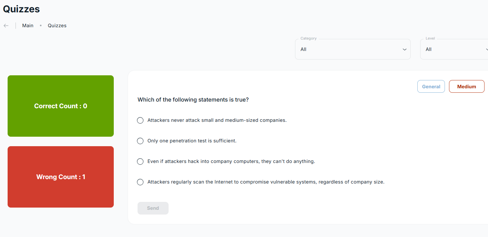
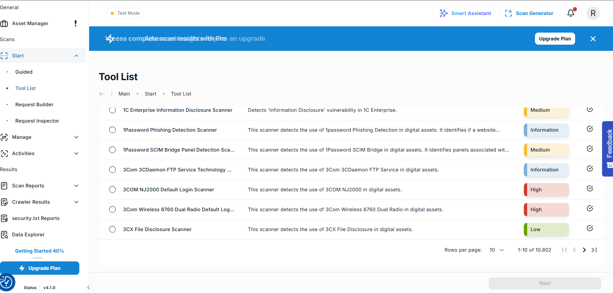

# S4E.io - Kapsamlı Test Otomasyonu ve Güvenlik Analizi Raporu

Bu çalışma, S4E.io platformu üzerinde gerçekleştirilen uçtan uca test süreçlerini belgelemektedir. Proje kapsamında sadece "mutlu yol" (happy path) senaryoları değil, sistemin sınırlarını zorlayan uç durumlar (edge cases) ve güvenlik zafiyetleri analiz edilmiştir.

## 🚀 Karar Verme Süreci ve Stratejik Adaptasyon
Projenin en önemli özelliği, karşılaşılan teknik engellere karşı geliştirilen hızlı adaptasyon yeteneğidir:
1. **Arayüz Analizi (UI):** Login modülünde Cloudflare bot koruması tespit edilmiş, testler bu kısıtlamaya göre (buton durum kontrolü) güncellenmiştir.
2. **API Seviyesine Geçiş:** UI kısıtlamalarını aşmak ve sistemin asıl "beyni" olan backend yapısını sınamak için doğrudan API testlerine odaklanılmıştır.

---
```text
🛠️ Kurulum ve Çalıştırma
Projeyi yerel ortamınızda ayağa kaldırmak için:

npm install

npx playwright test tests/api-test.spec.ts
npx playwright test tests/login.spec.ts
npx playwright show-report

🔑 API Yapılandırması (Configuration)
Güvenlik prensipleri gereği, proje içerisindeki hassas veriler (API Token) temizlenmiştir. API testlerini başarıyla koşturabilmek için şu adımı izlemelisiniz:

tests/api-test.spec.ts dosyasını açın.

Dosya içerisindeki YOUR_TOKEN alanını geçerli bir S4E API token'ı ile güncelleyin.

⚙️ Kullanılan Teknolojiler

Playwright – E2E test otomasyonu
TypeScript – Tip güvenliği
Node.js – Test çalışma ortamı

```


## 🔍 1. Login (Giriş Yap) Modülü UI Testleri
Login sayfasında, kullanıcı verilerinin doğruluğu ve formun güvenliği Playwright ile test edilmiştir.

### Uygulanan Senaryolar:
* **TC-01 (Geçersiz Format):** Hatalı e-posta formatında Giriş butonunun pasif (disabled) kalması.
* **TC-02 (Boşluk Kontrolü):** Sadece boşluk karakterleri girildiğinde sistemin girişi engellemesi.
* **TC-03 (Maskeleme):** Şifre alanının `type="password"` niteliğiyle maskelendiğinin doğrulanması.

### Teknik Analiz (Cloudflare Faktörü):
Otomasyon sırasında Cloudflare bot koruması devreye girdiği için Giriş butonu "enabled" durumuna geçmemiştir. Bu durum bir hata değil, **sistemin otomasyonu fark ederek kendini korumaya alması** olarak raporlanmıştır.

---

## 🔍 2. API /user/info Uç Noktası Güvenlik Analizi
Sistemin backend güvenliğini test etmek amacıyla `/api/user/info` uç noktasına doğrudan istekler (request) atılmıştır. Bu aşamada sistemde ciddi güvenlik açıkları tespit edilmiştir.

### API Test Çıktı Analizi
Yazılan testler kasıtlı olarak hatalı veri göndererek sistemin reddetmesini (401/400) beklemektedir. Ancak sistem her şeye onay vermiştir:

| Senaryo | Yapılan İşlem | Beklenen (Expected) | Alınan (Received) | Sonuç |
| :--- | :--- | :--- | :--- | :--- |
| **Token Eksik** | `data: {}` (Boş Body) | `Falsy` (Hata) | `true` (Başarılı) | ❌ Failed |
| **Sahte Token** | `'sahte_token_123'` | `Falsy` (Hata) | `true` (Başarılı) | ❌ Failed |
| **Hatalı Tip** | `token: 12345` (Sayı) | `Falsy` (Hata) | `true` (Başarılı) | ❌ Failed |

### Örnek Çıktı Analizi:

#### 1. Token Parametresi Eksik Gönderildiğinde (TC-02)
Bu senaryoda sistemin boş bir isteği reddetmesi beklenirken, API'nin isteği başarılı kabul ettiği görülmüştür.
```text
1) [chromium] › tests\api-test.spec.ts:28:7 › TC-02: Token parametresi eksik gönderildiğinde sistem isteği reddetmeli 

   Error: expect(received).toBeFalsy()
   Received: true

   > 35 |      expect(response.ok()).toBeFalsy();

Analiz: Received: true ifadesi, backend tarafında zorunlu alan kontrolünün (required field validation) eksik olduğunu göstermektedir.

2. Geçersiz/Sahte Token Gönderildiğinde (TC-03)
Sistem, veri tabanında bulunmayan "sahte_token" gibi bir anahtarı kabul ederek veri sızdırma riskine kapı açmaktadır.

2) [chromium] › tests\api-test.spec.ts:38:7 › TC-03: Geçersiz/Sahte Token ile veri sızdırma girişimi engellenmeli 

   Error: expect(received).toBeFalsy()
   Received: true

   > 47 |      expect(response.ok()).toBeFalsy();

3. Veri Tipi Doğrulaması (Type Safety) İhlali (TC-04)
Metin (String) beklenen "token" alanına sayı (Integer) gönderildiğinde sistemin tip kontrolü yapmadığı tespit edilmiştir.

3) [chromium] › tests\api-test.spec.ts:50:7 › TC-04: Token string yerine farklı veri tipinde (int) gönderildiğinde sistem çökmameli 

   Error: expect(received).toBeFalsy()
   Received: true

   > 60 |      expect(response.ok()).toBeFalsy();


```
📸 Hata Kanıtları (Visual Evidence)


#### API Güvenlik Zafiyeti Raporu:



## 🐞 3. Manuel Keşifsel Test: 
## Quizzes Modülü
Otomasyon dışında yapılan manuel incelemelerde, uygulama mantığında (Business Logic) ciddi bir hata tespit edilmiştir.
* **Bulgu:** Sınav modülünde aynı soruya üst üste farklı yanlış cevaplar verildiğinde "Wrong Count" sayacı artmamaktadır.
* **Önem Derecesi:** Yüksek (High) - İstatistiksel verilerin doğruluğunu bozmaktadır.

#### 
#### 

## UI/Responsive Layout Hatası - Metin Çakışması (Overlap)

* **Bulgu**: "Tool List" sayfasındaki ana bilgilendirme banner'ında (mavi alan), viewport boyutu daraldığında (mobil veya tablet görünümü) metin elementleri arasında CSS çakışması (overlap) yaşanmaktadır.

* **Analiz**: Görsel kanıtta görüldüğü üzere (bug_images/ui_bug.png), metin konteynerlarının esnek (flex/grid) yapısı veya minimum genişlik ayarları doğru kurgulanmadığı için, responsive tasarıma uyum sağlanamamıştır. Bu durum, kritik bilgilendirme alanının okunabilirliğini tamamen ortadan kaldırarak kullanıcı deneyimini (UX) olumsuz etkilemektedir.
* 
#### UI Metin Kayması Hatası:

